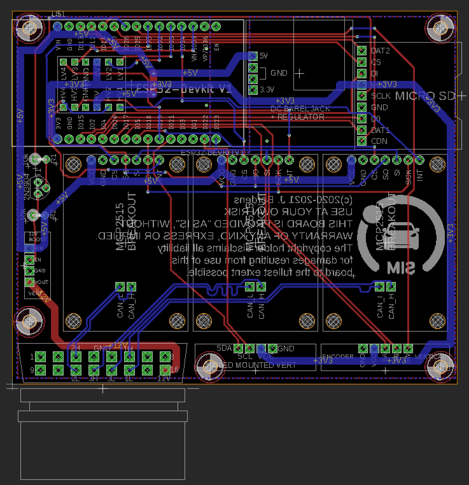

# CanBusSimulator
3-Bus CAN Simulator. Optimized for ease of assembly from breakout boards.

This thing probably only solves my problems.  I don't expect it to be of much
use to anyone else.

This is a 3-Bus CAN Bus Simulator designed to help me with the development of
[tesLAX](https://teslax.app).

While I could make this much smaller, I wanted to assemble it quickly without
stencils or surface mount.  Hence it is built from readily available
breakout boards.

It is still under development.  Final design and source code to follow.

# BOM

- ESP32 - a Node32s or equivalent.
- MCP2515 - CAN Bus Transceiver Breakout Boards.  These are intended to mount
to the top of the main PCB with the headers installed to the underside of
the breakout board.
- MicroSD Breakout - with all the pins not just the SPI ones.  Designed with
this board in mind: https://www.aliexpress.com/item/32787519908.html
- I2C OLED - a 128x64 OLED of the typical type.  Note that these come with
various pinouts, so hopefully you (and I both) get the same pinout as this
main PCB expects.  Also it is intended to be mounted upside-down using a 
right angle header.
- Encoder - again, intended to be mounted upside down with right angle 
headers.  Designed for this PCB: https://www.aliexpress.com/item/4001242057510.html
- DC Power Jack - had some extra space, so why not?  Designed to accept
this breakout board: https://www.aliexpress.com/item/32677142070.html
- Level Shifter - a typical cheap level shifter of the type outlined on the
main PCB.
- 12v Step Up - to power accessories connected to the OBD-2 port, which 
is a 12v source.  With Enable.  Designed with this one in mind: https://www.aliexpress.com/item/32902463323.html
- OBD-2 FEMALE Right Angle Connector - hard to find.  One like this
https://www.macchina.cc/catalog/parts/obd2-female-right-angle-pth-connector
but I'm actively looking for more cost effective options.

# Links

Schematic [PDF](schematic.jpg)

